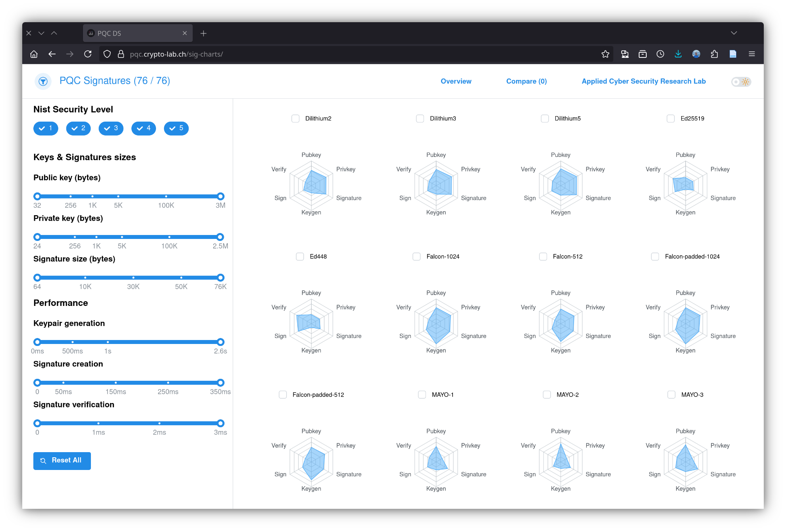

## Purpose 

This directory contains a Dockerfile that runs a [Plotly Dash](https://plotly.com/) webapp showing an overview of all
the digital signature algorithms supported by `liboqs`. The visualization aims to allow people to quickly filter and
compare digital signature algorithms by their public functions performance (keypair generation, sign and verify) and the
keys and certificate sizes.

## Getting started

[Install Docker](https://docs.docker.com/install) and run the following
commands in this directory:

1. `docker build -t pqc-sig-plotly .`
2. `docker run --detach --rm --name pqc-sig-plotly -p 7000:7000 pqc-sig-plotly`

## Usage

Complete information how to use the image is [available in the separate file USAGE.md](USAGE.md).

## Build options

The Dockerfiles provided can be configured with the following variables:

### ALPINE_VERSION

The version of the `alpine` docker image to to be used.

### PYTHON_VERSION

The version of Python used.

### LIBOQS_TAG

Tag of `liboqs` release to be used.

### LIBOQS_PYTHON_TAG

Tag of `liboqs-python` release to be used.
