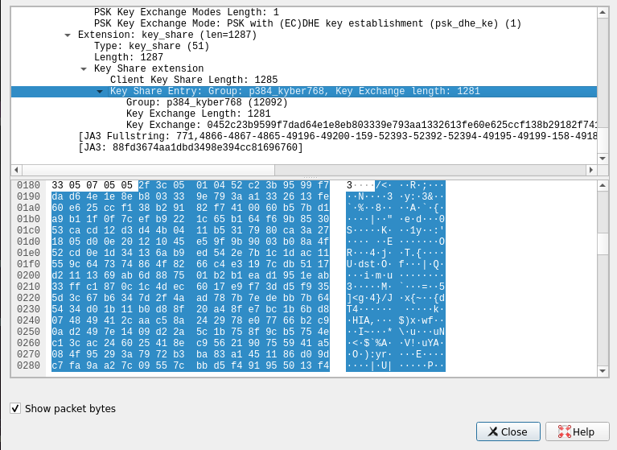

# Usage of the client side container

The post quantum key exchange [openssl](https://github.com/open-quantum-safe/openssl) variant and [getdns](https://getdnsapi.net/) were installed to query the DNS server with a post quantum key exchange algorithm.
## Installation
Assuming you have docker [installed](https://docs.docker.com/install) on your machine all command below will launch getdns docker.

Run getdns container:
```bash
    docker run --network unbound-test --interactive --tty --hostname getdns --name getdns -it openquantumsafe/getdns
```
After running all the command above a container will open with getdns running with openssl post quantum variant.

## Usage


The key exchange between the server and the client is set on p384_kyber768:X25519, other key exchange algorithms can be used, find more algorithm in the [list of available post quantum key exchange algorithms](https://github.com/open-quantum-safe/boringssl#key-exchange). To specify the desired key exchange algorithm use the parameter `-e` in the `docker run` command.The example below used `kyber1024` to do the key exchange.

```bash
     docker run --network unbound-test -e TLS_DEFAULT_GROUPS=kyber1024 --interactive --tty --hostname getdns --name getdns -it openquantumsafe/getdns
```

To query the DNS server, run the command:

```bash
    getdns_query -s -d example.com A @<DNS server container ip>:853 -L +return_call_reporting
```

The DNS server container has the name of "unbound" to get its ip address use the command:
```bash
    docker network inspect unbound-test
```

Below is an example output of the command where "unbound" has the ip address of 172.20.0.2.
```json
    "Containers": {
            "3763586e7b1fce6232671e7d2515cf7aa2bbfb0ba90231b2e0945f2bebb7242c": {
                "Name": "getdns",
                "EndpointID": "e6b043d166395b1ce6b368ab3ec975f7ffa7eac517a3b3f9774c2950ce4c126d",
                "MacAddress": "02:42:ac:14:00:03",
                "IPv4Address": "172.20.0.3/16",
                "IPv6Address": ""
            },
            "95e5bd787333afc893e90e2398407133f1a421933eabdf1c0cd77eaec6feb5e2": {
                "Name": "unbound",
                "EndpointID": "3479a7c99d9cea7a76218f449ca1bafd35527d79778bcd4af68e8113d96166dd",
                "MacAddress": "02:42:ac:14:00:02",
                "IPv4Address": "172.20.0.2/16",
                "IPv6Address": ""
            }
        },
```
After query the DNS server, we can check the key exchange algorithm using wireshark. To verify the key exchange algorithm, use the post quantum [wireshark](https://github.com/open-quantum-safe/oqs-demos/tree/main/wireshark) variant to check the "client hello" package.



# DISCLAIMER

[Please check the limitations and security information](https://github.com/open-quantum-safe/openssl#limitations-and-security)
